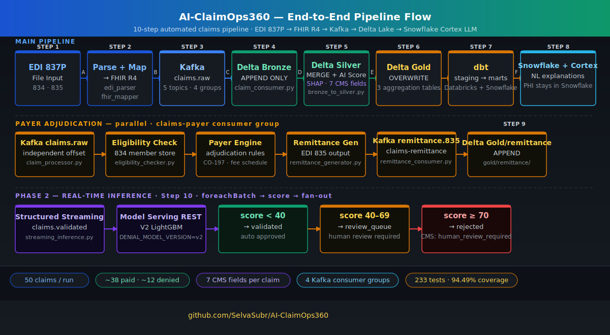
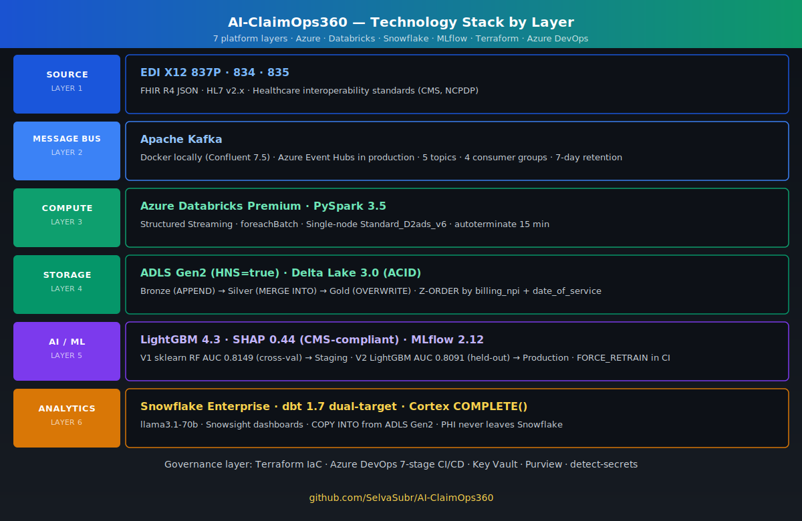
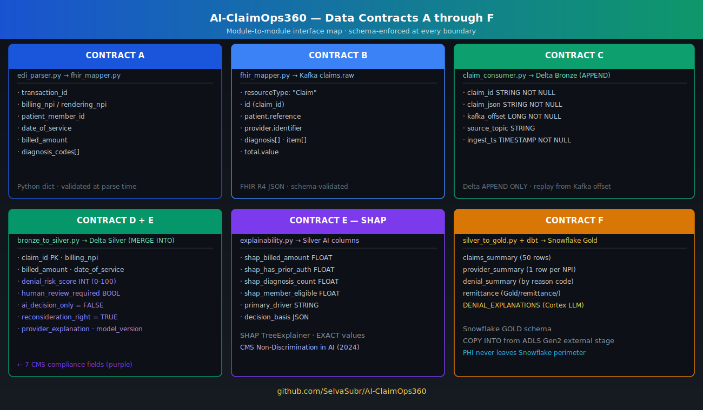
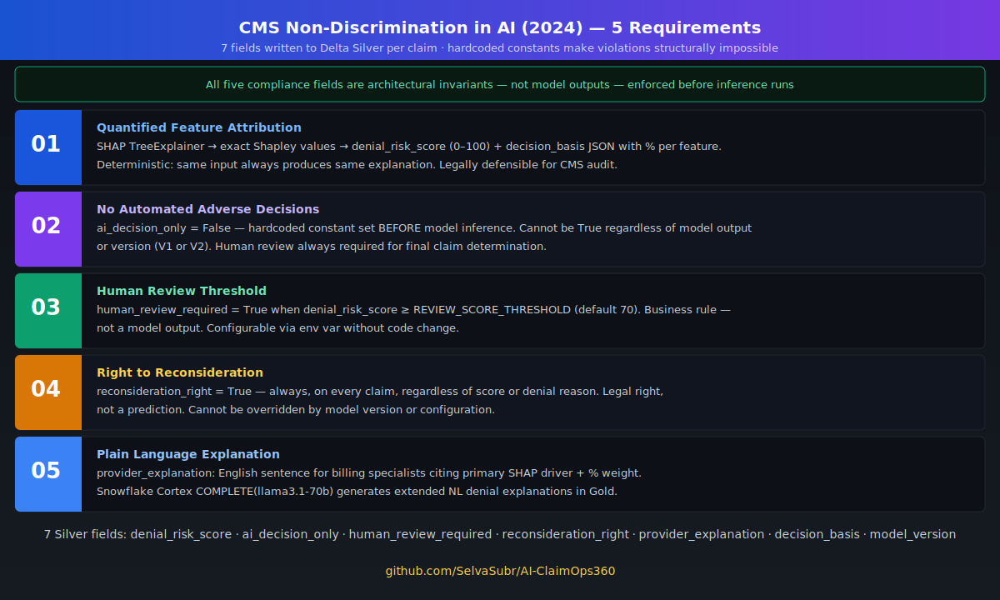
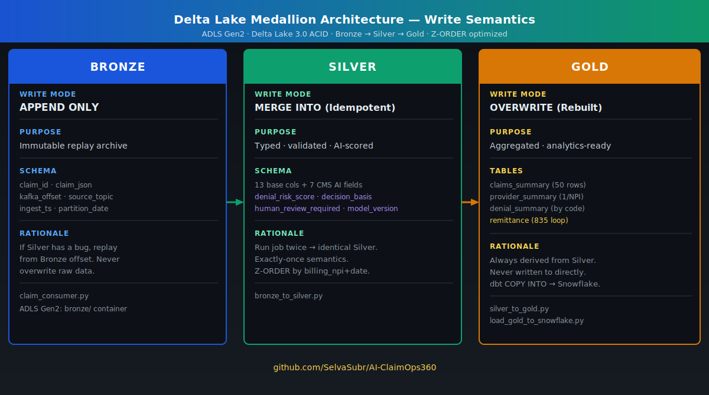
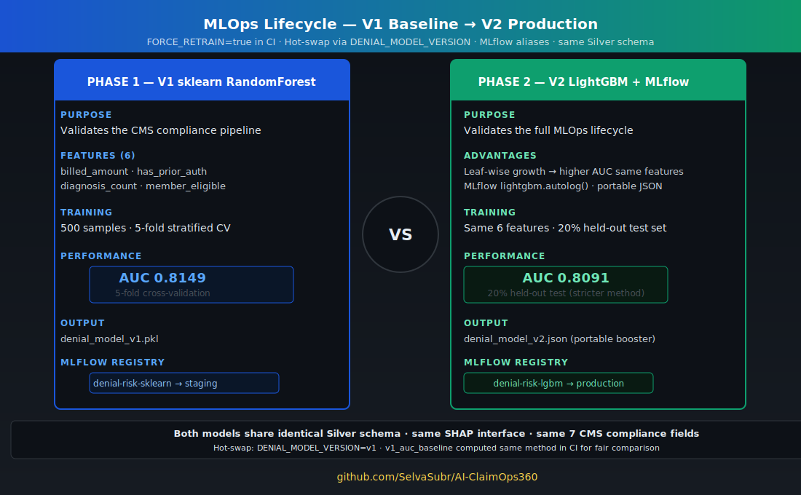
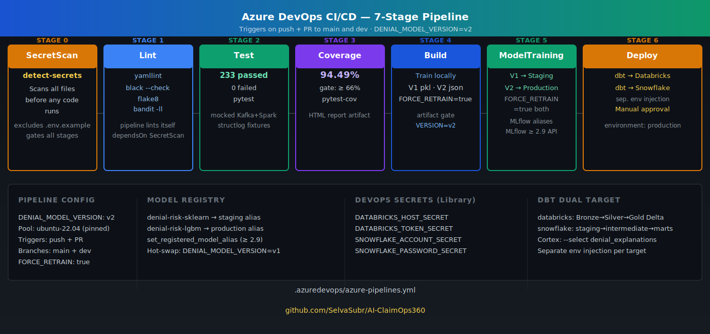

# AI-ClaimOps360

<!-- Core Platform -->
[](https://python.org)
[](https://spark.apache.org)
[](https://delta.io)
[](https://kafka.apache.org)
[](https://databricks.com)
[](https://snowflake.com)
[](https://getdbt.com)
[](https://mlflow.org)
[](https://lightgbm.readthedocs.io)
[](https://scikit-learn.org)
[](https://shap.readthedocs.io)
[](https://snowflake.com/en/data-cloud/cortex/)
[](tests/)
[](pytest.ini)
[](.azuredevops/azure-pipelines.yml)
[](LICENSE)

**Author:** Selvakumar S. | **Last Updated:** May 2026

**Docs:** [Architecture Diagrams](docs/diagrams/) · **Decisions:** [ADRs](docs/adr/) · **Demo:** [Screenshots](docs/screenshots/)

---

## Overview

End-to-end healthcare payer claims processing pipeline — EDI X12 ingestion through AI-driven denial risk scoring and Snowflake analytics — designed for HIPAA-regulated PHI, FHIR interoperability, and CMS-compliant explainable AI embedded at the architecture level rather than retrofitted.

Built at the intersection of payer operations, data engineering, and applied AI. The system reflects real-world claims semantics (e.g., CO-197 denial logic) and enforces deterministic, audit-safe decisioning suitable for regulated healthcare environments.

- **Compliance is structural.** CMS-required fields are hardcoded invariants, not model outputs — violations are architecturally impossible.
- **PHI stays in the perimeter.** Cortex COMPLETE() generates denial explanations in SQL inside Snowflake — no external LLM, no BAA.
- **Explainability is exact and deterministic.** SHAP TreeExplainer on both models; LIME rejected for non-determinism.
- **Replay-safe by design.** Bronze append-only · Silver idempotent · Gold derivable. Four independent consumer groups, no offset contention.
- **Model governance enforced in CI.** `FORCE_RETRAIN=true` ensures no model enters the registry without a fresh run. V1 ↔ V2 swap via environment flag with zero schema impact.

---

## Healthcare & Compliance Context
[]()
[]()
[]()
[]()
[]()

---

## Architecture

### End-to-End Pipeline Flow



### Technology Stack by Layer



---

## What This Project Builds

| Step | Module | Input | Output |
|---|---|---|---|
| **1. Parse** | `src/ingestion/edi_parser.py` | EDI X12 837P/834 file | Contract A dict |
| **2. Map** | `src/ingestion/fhir_mapper.py` | Contract A | FHIR R4 JSON (Contract B) |
| **3. Produce** | `src/ingestion/claim_producer.py` | FHIR JSON | Kafka `claims.raw` |
| **4. Ingest** | `src/streaming/claim_consumer.py` | Kafka message | Delta Bronze (APPEND) |
| **5. Transform + Score** | `src/streaming/bronze_to_silver.py` + `src/ai_validation/` | Bronze row | Delta Silver — 7 CMS AI fields + SHAP |
| **6. Aggregate** | `src/streaming/silver_to_gold.py` | Silver table | 3 Gold Delta tables |
| **7. Adjudicate** | `src/payer_simulation/` | FHIR claim | EDI 835 remittance → Kafka `remittance.835` |
| **8. Remittance** | `src/streaming/remittance_consumer.py` | Kafka remittance | Delta Gold/remittance |
| **9. Analyse** | `dbt/` + Snowflake | Gold tables | dbt marts + Cortex LLM explanations |
| **10. Serve (Phase 2)** | `src/streaming/streaming_inference.py` | Kafka stream | Fan-out to 3 output topics by risk score |

---

## Data Contracts

### Module-to-Module Interface Map



---

## CMS Regulatory Compliance

### 2024 Non-Discrimination in AI Rule — All 5 Requirements



Every scored claim carries all five required fields. Compliance fields are hardcoded constants — not model outputs — making violations **structurally impossible**:

```python
# src/ai_validation/explainability.py
cms_fields = {
    "ai_decision_only":      False,                    # Requirement 2
    "reconsideration_right": True,                     # Requirement 4
    "human_review_required": denial_risk_score >= 70,  # Requirement 3 — rule, not model
    "denial_risk_score":     int(round(score * 100)),  # Requirement 1 — SHAP normalised
    "provider_explanation":  _build_explanation(...),  # Requirement 5
}
```

---

## Delta Lake Medallion Architecture



| Layer | Write Mode | Key Design Rule |
|---|---|---|
| **Bronze** | `APPEND ONLY` | Never overwrite. Replay from Kafka offset on failure. |
| **Silver** | `MERGE INTO` (Idempotent) | Run twice → identical result. Exactly-once semantics. |
| **Gold** | `OVERWRITE` (Rebuilt) | Always derived from Silver. Never written to directly. |

---

## MLOps Lifecycle



**Deliberate two-phase design:** V1 (sklearn RF) validates the CMS compliance pipeline. V2 (LightGBM) demonstrates the full MLOps lifecycle. Both share the same Silver schema — no downstream changes when switching models.

| Model | Algorithm | AUC | Measurement | MLflow Stage |
|---|---|---|---|---|
| V1 | sklearn RandomForest | 0.8149 | 5-fold cross-val | Staging (baseline) |
| V2 | LightGBM | 0.8091 | 20% held-out test | Production (champion) |

> Note: V1 cross-val AUC is slightly inflated vs a held-out split. `train_lgbm_model.py` computes `v1_auc_baseline` using the same cross-val method for a fair side-by-side — visible in Databricks MLflow runs.

```bash
make train      # V1 → denial_model_v1.pkl  → MLflow Staging
make train-v2   # V2 → denial_model_v2.json → MLflow Production
make train-all  # Both in sequence
```

---

## CI/CD Pipeline



7-stage Azure DevOps pipeline — PRs trigger Stages 0–4; Stages 5–6 (ModelTraining + Deploy) run on `main` branch only:

| Stage | What it does |
|---|---|
| **SecretScan** | `detect-secrets` scans all files before any code runs |
| **Lint** | `yamllint` + `black` + `flake8` + `bandit` — pipeline lints itself |
| **Test** | 234 unit tests, `pytest` with structlog + mocked Kafka/Spark |
| **Coverage** | 94.49% coverage gate (threshold: 66%) |
| **Build** | Train V1 + V2 locally (`FORCE_RETRAIN=true`) · verify artifacts produced · gates ModelTraining |
| **ModelTraining** | Train V1 + V2 · artifact integrity check (`.pkl` + `.json`) · MLflow Staging + Production · `FORCE_RETRAIN=true` |
| **Deploy** | dbt Databricks target + dbt Snowflake target · manual approval gate |

```yaml
# Pipeline variable — shared across all stages
DENIAL_MODEL_VERSION: v2
```

---

## Architecture Decision Records

| ADR | Decision | Why |
|---|---|---|
| [ADR-001](docs/adr/ADR-001.md) | Medallion Architecture | Bronze=replay · Silver=idempotent · Gold=derivable |
| [ADR-002](docs/adr/ADR-002.md) | Kafka for decoupling | 7-day replay · 4 independent consumer groups |
| [ADR-003](docs/adr/ADR-003.md) | sklearn V1 baseline | AUC narrative 0.8149→0.8091 · model-agnostic compliance |
| [ADR-004](docs/adr/ADR-004.md) | Snowflake Cortex LLM | PHI never leaves Snowflake · no external API |
| [ADR-005](docs/adr/ADR-005.md) | SHAP TreeExplainer | Exact values · deterministic · CMS defensible |
| [ADR-006](docs/adr/ADR-006.md) | Databricks + Snowflake hybrid | Right tool per workload |
| [ADR-007](docs/adr/ADR-007.md) | LightGBM for V2 | Leaf-wise growth · MLflow autolog · portable JSON |

---

## Quick Start

```bash
git clone https://github.com/SelvaSubr/AI-ClaimOps360.git
cd AI-ClaimOps360
python -m venv .venv && source .venv/bin/activate
pip install -r requirements.txt
cp .env_example .env        # fill in required variables
make kafka-up               # start Kafka + ZooKeeper + UI
make train-all              # V1 → Staging, V2 → Production
make pipeline               # full end-to-end: 50 claims, ~38 paid, ~12 denied
make test                   # 234 tests, 94.49% coverage
```

---

## Make Targets

| Target | What it does |
|---|---|
| `make kafka-up` | Start Kafka + ZooKeeper + Schema Registry + Kafka UI |
| `make kafka-topics` | Create all 5 topics |
| `make train` | Train V2 LightGBM (production default) → `denial_model_v2.json` + MLflow |
| `make train-v1` | Train V1 sklearn RF (regression baseline) → `denial_model_v1.pkl` |
| `make train-all` | Both models in sequence (V1 then V2) |
| `make pipeline` | Full local pipeline — topic reset + 50 claims end-to-end (V2) |
| `make pipeline-v1` | Full local pipeline using V1 model (regression/rollback test) |
| `make archive` | Drain validated/review/rejected topics to NDJSON archive files |
| `make test` | All 234 tests with coverage ≥ 66% |
| `make lint` | `black` + `isort` + `flake8` + `bandit` |
| `make snowflake-load` | Refresh ADLS external tables in Snowflake (zero-copy) |

---

## Repository Structure

```
AI-ClaimOps360/
├── src/
│   ├── ingestion/          # EDI parser, FHIR mapper, Kafka producer
│   ├── streaming/          # Bronze/Silver/Gold Spark jobs, claim processor
│   │                       # remittance consumer, transaction archiver
│   │                       # streaming inference (Phase 2)
│   ├── payer_simulation/   # Payer engine, fee schedule, eligibility (834)
│   │                       # remittance generator (835), enrollment parser
│   └── ai_validation/      # LightGBM + sklearn training, SHAP explainability
│                           # MLflow utils, streaming inference scorer
├── tests/                  # Integration + pipeline tests (pytest)
├── data_quality/           # Great Expectations suites + checkpoints
├── dbt/                    # Staging, intermediate, marts models
│                           # Dual target: Databricks + Snowflake
├── snowflake/              # DB/schema/role setup, ADLS external tables, Cortex Analyst queries
│   └── external_tables/
├── infra/                  # Terraform — Azure + Snowflake modules
│   └── modules/            # databricks, kafka, snowflake, storage
├── docker/                 # Dockerfiles + Compose for local dev
├── sample_data/            # EDI 837P (50-claim pipeline), 834, 835, FHIR
├── docs/
│   ├── adr/                # 7 Architecture Decision Records
│   └── diagrams/           # 8 architecture SVG diagrams
└── .azuredevops/           # 7-stage CI/CD pipeline definition
```

---

## Infrastructure

Fully provisioned via Terraform (`infra/`):

| Resource | Purpose |
|---|---|
| Azure Databricks | Spark jobs, MLflow Model Registry |
| Azure ADLS Gen2 | Delta Lake storage (silver/, gold/ containers) |
| Azure Event Hubs | Kafka-compatible broker (5 topics) |
| Azure Key Vault | Secrets — SP credentials, PAT tokens |
| Snowflake Enterprise | dbt marts, Cortex LLM, Snowsight dashboards |

```bash
cd infra && terraform init && terraform apply
# Provisions 27 resources across Azure + Snowflake
```

---

## About
Architected by [Selvakumar S.](ABOUT.md) — Platform Architect and Software Engineer specializing in healthcare payer systems, regulated AI infrastructure, and enterprise-scale data platforms.

## Connect

- GitHub: [github.com/SelvaSubr](https://github.com/SelvaSubr)
- LinkedIn: [linkedin.com/in/SelvaSubr](https://linkedin.com/in/SelvaSubr)
- This project: [AI-ClaimOps360](https://github.com/SelvaSubr/AI-ClaimOps360)

Licensed under [MIT](LICENSE).
